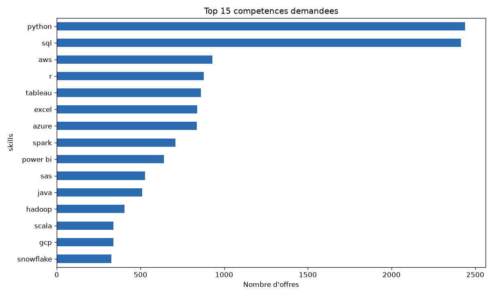
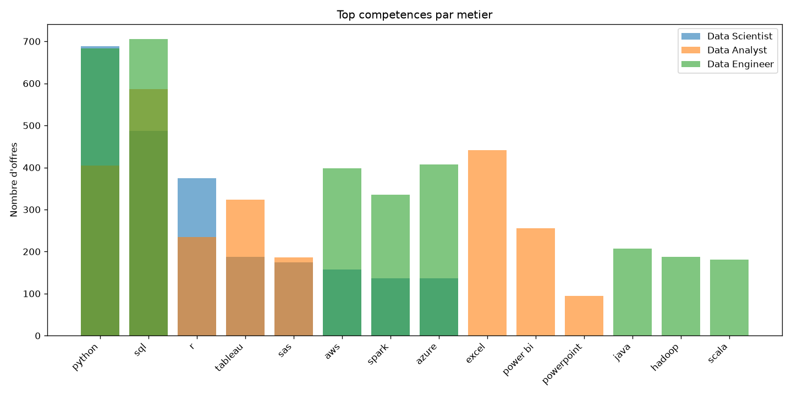
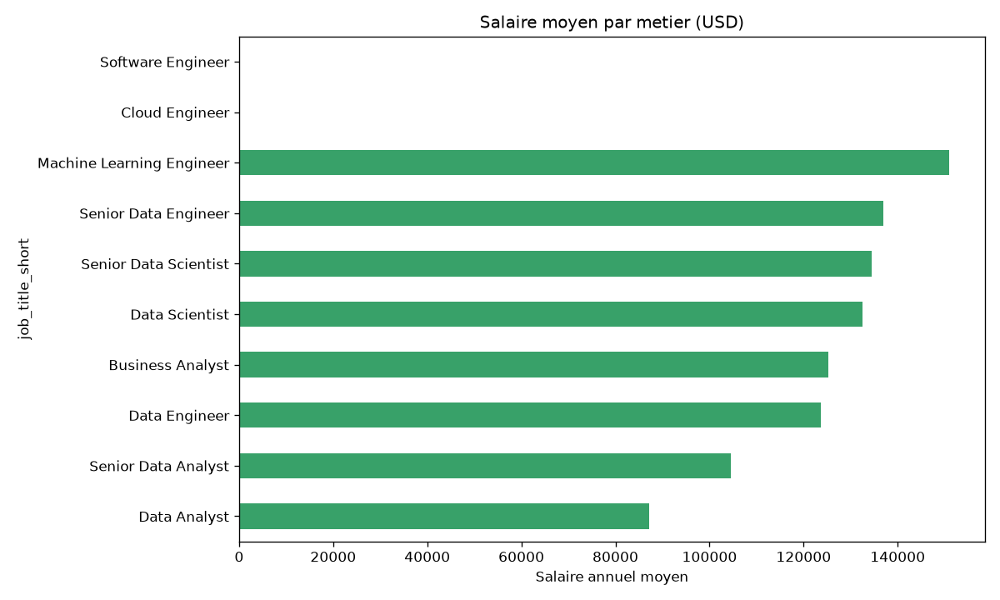

# JobMatch AI

Assistant de **présélection de CV** : à partir d'une offre d'emploi et de plusieurs CV,
le système **classe les candidats par pertinence**, avec un **score**, les **compétences
présentes / manquantes** et une **justification**. Inclut une **analyse du marché de l'emploi**.

**Demo en ligne :** `https://cv-screener-abc123.onrender.com` (à remplacer par ton URL Render)

## Fonctionnalités

- **Extraction de texte** des CV (PDF)
- **Scoring de pertinence** CV ↔ offre via LLM (**local Ollama** ou **cloud Groq**)
- **Classement** avec score, compétences manquantes et justification
- **Analyse du marché** : compétences les plus demandées, par métier, salaires
- **Éthique** : l'IA trie et explique, l'humain décide (données personnelles / RGPD)

## Architecture

```
Offre d'emploi ─┐
                ├─► Extraction texte CV ─► Scoring LLM (Ollama / Groq) ─► Classement + justification
CV (PDF) ───────┘
```

## Stack

- `pdfplumber` : extraction de texte des PDF
- `groq` / `ollama` : scoring LLM (cloud / local)
- `gradio` : interface
- `datasets` + `pandas` + `matplotlib` : analyse du marché

## Installation

```powershell
python -m venv .venv
.\.venv\Scripts\activate
python -m pip install --upgrade pip
python -m pip install -r requirements.txt
```

Clé cloud : crée un fichier `.env` (voir `.env.example`) :

```text
GROQ_API_KEY=ta_cle_ici
```

Génération locale (optionnelle) :

```powershell
ollama pull llama3.2:3b
```

## Utilisation

Lancer l'interface :

```powershell
python -m src.app_cv
```

Puis ouvrir http://127.0.0.1:7863 : colle l'offre, dépose les CV (PDF/TXT), clique **Submit**.

## Évaluation

**Protocole** : 3 CV d'exemple (un profil Data Scientist, un junior, un développeur web)
et une offre de Data Scientist. Vérité de référence : le CV data est le plus pertinent.

| Moteur | Scores data / junior / web | Top-1 | Ordre exact |
|---|---|---|---|
| Ollama 1B | 80 / 60 / **80** | OK | **NON** |
| Ollama 3B | 80 / 40 / 20 | OK | OK |
| Groq 20B | 90 / 30 / 0 | OK | OK |

**Enseignements**
- Le petit modèle local (**1B**) **hallucine** (il attribue des compétences absentes) et classe mal.
- Le **3B** local est **correct et privé**.
- Le **20B cloud** est le plus fiable.
- ⚠️ Le « Top-1 OK » du 1B est **trompeur** (ex æquo) → il faut croiser les métriques.

## Analyse du marché

Échantillon de **5 000 offres** (dataset `lukebarousse/data_jobs`, 785 741 au total).

### Compétences les plus demandées



### Compétences par métier



### Salaire moyen par métier



**Principaux constats**
- `python` et `sql` dominent largement toutes les offres data.
- Le **cloud** (`aws`, `azure`, `gcp`) et le **Big Data** (`spark`) sont très présents.
- Le **BI** (`tableau`, `power bi`, `excel`) reste central pour les Data Analysts.
- Salaire moyen le plus élevé : **Machine Learning Engineer**, devant les profils seniors.

## Limites et éthique

- **Aide à la décision** uniquement : **l'humain décide**, jamais de rejet automatique.
- Les CV sont des **données personnelles** : traitement **local par défaut** (RGPD).
- Risque de **biais** : un tri automatisé peut discriminer ; il faut auditer et garder un humain dans la boucle.
- Jeu de test réduit (3 CV) → résultats indicatifs.

## Structure

```
cv-screener/
|-- data/            # CV d'exemple, échantillon, figures
|-- src/
|   |-- extract_skills.py  # extraction compétences / expérience
|   |-- score_cv.py        # scoring CV vs offre
|   |-- evaluate.py        # comparaison des moteurs
|   |-- explore_jobs.py    # EDA du marché
|   |-- plots.py           # graphiques
|   `-- app_cv.py          # interface Gradio
|-- tests/
|-- Dockerfile
`-- README.md
```
